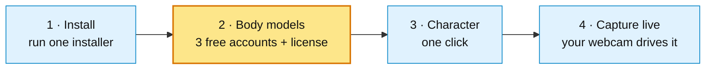
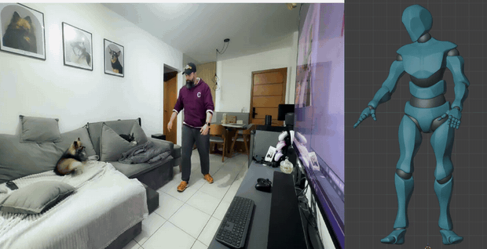

# Getting started with PoseCap

By the end of this page a 3D character in Blender moves live with a person on
your webcam — no mocap suit, no markers. It takes about 20 minutes, and most of
that is downloads you can leave running.

This is the **complete, do-it-once path**. Follow it top to bottom; every step is
here, so you never have to leave and come back. (Want depth on one feature later?
Each step links a focused guide at the end.)

> **One thing to know up front.** PoseCap drives the **SMPL-X body model**, which
> is free for research but **licensed by the Max Planck Institute** — so it can't
> be shipped inside PoseCap. You register free on three official sites (about five
> minutes) and PoseCap downloads and installs everything else for you. **That
> sign-up is the only part you do by hand** — and it is the one step below that is
> worth reading slowly.

Only **step 2** needs you to do anything by hand — a one-time, free licensing
sign-up. Everything else is one click or fully automatic.

## What you need

| | |
|---|---|
| **OS** | Windows 10 or 11 |
| **GPU** | NVIDIA RTX 30 / 40 / 50 series with an up-to-date driver (CUDA is required — there is no CPU mode) |
| **Blender** | 4.2 LTS or newer (5.x supported) — install it first from [blender.org](https://www.blender.org/download/) |
| **Camera** | Any webcam, or a video file to test with |

## 1. Install PoseCap

Download the latest `PoseCap_..._Windows_Setup.exe` from the
[releases page](https://github.com/CorridorTech/PoseCap/releases/latest) and run
it. It needs **no administrator rights** — it installs into your user folder.

Click through the wizard: **Accept** the license → keep the default **destination**
→ **Install**. The long part is the **~4 GB GPU runtime** (PyTorch and the PEAR
engine) it fetches during install — leave it running, then click **Finish**.

PoseCap also installs its panel into Blender for you. That is the whole install —
no files to place, no paths to set.

> Nothing licensed is downloaded here. The body models are the next step, done
> with your own account.

## 2. Get the body models — the one part that needs you

This is the step to slow down for. It is a **one-time, free** setup of the SMPL-X
research body models. Because they are licensed (see the note at the top), you
create the accounts; PoseCap does the downloading, unzipping, and installing — no
files to find or move.

Total time: about five minutes, plus a ~500 MB download.

### 2a. Create your three free accounts (this *is* the license step)

Register on each of the three official sites, using the **same email and password
on all three** (that keeps the next part to a single login):

| Site | Register |
|---|---|
| SMPL | <https://smpl.is.tue.mpg.de/register.php> |
| SMPL-X | <https://smpl-x.is.tue.mpg.de/register.php> |
| FLAME | <https://flame.is.tue.mpg.de/register.php> |

On each form, enter your email, pick a password (**at least 8 characters**), and
**turn every license toggle green**. Flipping those toggles on **is** the license
acceptance — there is nothing else to sign; you can leave *Receive Emails* off.
The toggles differ slightly per site:

**SMPL** — *Accept terms* + *Accept license*:

**SMPL-X** — *Accept terms* + *Accept model license* + *Accept body license*:

**FLAME** — *Accept terms* + *Accept model license* + *Accept data license*:

All three are required — PoseCap needs one file from each (SMPL, SMPL-X, and the
FLAME head model that SMPL-X uses).

### 2b. Confirm your email — check your spam folder

Each site emails you a verification link that **must be clicked before downloads
work**. That mail very often lands in **spam/junk** — look for it there, open it,
and click **Confirm my account**:

An unconfirmed account is the usual reason a download later fails with a login
error, so don't skip this.

### 2c. Let PoseCap download and install everything

Open Blender. In the 3D Viewport press **`N`** to open the sidebar, then click the
**PoseCap** tab. You will see the **Getting Started with PoseCap** checklist, with
capture disabled until it is complete — so you can never click into an error:

Click **Set Up** on the first row. Enter the **email and password** from step 2a
and click **OK**:

Your password is used once, in memory, to download from the official server — it
is never saved or logged, and the field clears the moment the download starts. A
progress bar shows each file as it lands:

When every file is in, the first checklist row turns to a green tick.

> Don't want to type your password into Blender? The same dialog has a **Watch my
> Downloads Folder** option — download the three files yourself in a browser and
> PoseCap picks them up. Full details and troubleshooting: the
> [body-models guide](smplx-model-setup.md).

## 3. Set up a character

Bring in any **Mixamo** or **Unreal Engine** character (or use the built-in SMPL-X
body): **File → Import → FBX**. It will import small and lying on its side — that
is normal, the next click fixes it.

In the PoseCap panel, pick your character's armature as the **Target Armature**,
leave **Skeleton** on **Auto-Detect**, and click **Convert Character for PoseCap**.
One click reorients and renames the skeleton, then self-checks its work
(*"Character converted — probe error 0.0000"*):

Full walkthrough, including custom skeletons: the
[character-setup guide](character-setup.md).

## 4. Capture it live

The payoff. Pick your **Source** — a **webcam**, or a **video file** to test with
(a clip loops, so your character keeps moving) — turn on **Show Preview Window**,
and click **Start Stream**.

> **The very first Start Stream downloads the AI model (~2.7 GB), once.** The panel
> shows *"Still starting — this can take a few minutes…"* — that is the download,
> not a freeze. Leave it running; every later start is immediate.

Once frames arrive, your character moves with the person in the source, in real
time. Turn on **Record Live MoCap** to bake the motion onto the timeline as
keyframes.

Full options — smoothing, per-limb filters, and the **Camera Pitch** control that
keeps a tilted-camera capture upright: the [live-capture guide](live-capture.md).

---

That is the whole pipeline: **install → models → character → live capture.** You
now have a character you can drive from any webcam.

**Go deeper, per feature:**

- [Set up the body models](smplx-model-setup.md) — the licensed download, the Watch-Downloads option, and troubleshooting.
- [Set up a character](character-setup.md) — Mixamo, Unreal, and custom-skeleton mapping.
- [Live capture](live-capture.md) — source options, recording, smoothing, and camera tilt.

Any time you want to confirm your setup is healthy, run **PoseCap Doctor**
(Start Menu → PoseCap → PoseCap Doctor) — every check should be green.
