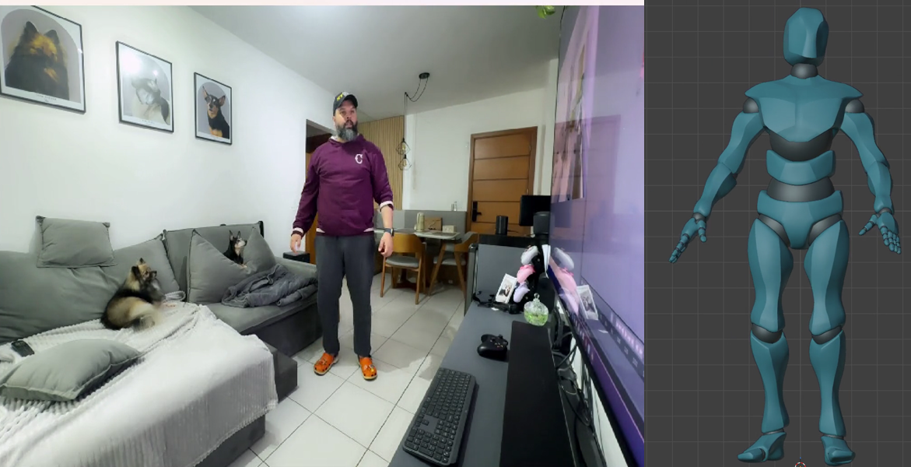

# Live capture

> **New to PoseCap?** Do the [Getting Started guide](getting-started.md) first —
> it covers install, models, and character in one flow. This page is the focused
> reference for capturing: every source and recording option, the fine-tuning
> controls, and fixing a capture that looks off.

This is the payoff: a person in front of your webcam (or in a video file) drives
your character in Blender, in real time.

Before you start, the Getting Started checklist must be complete — the
[body models installed](smplx-model-setup.md) and a
[target character set up](character-setup.md). Until then **Start Stream** stays
disabled, with the hint *"Finish Getting Started above to enable capture."*

## Pick your source

In the PoseCap panel, **Source** chooses where capture comes from:

- **Camera** — a live webcam. Pick the device in **Camera** (0 is the default).
- **Video File** — a recorded clip, which acts as a virtual camera. Set the
  **Video File** path. This is the easiest way to test: the clip loops, so your
  character keeps moving.

Turn on **Show Preview Window** to open a separate window with the live
camera/video feed while you stream — handy for lining up the shot and for
confirming the person is detected.

## Start the stream

Click **Start Stream**.

> **The very first Start Stream downloads the AI model (~2.7 GB), once.** Before
> the first frame appears, PoseCap fetches the pinned pose-estimation model. The
> panel shows *"Still starting — this can take a few minutes; the very first run
> also downloads the AI model (~2.7 GB)."* That is the download, not a freeze —
> leave it running. Every later start is immediate.

Once frames arrive, your character moves with the person in the source. Click
**Stop Stream** to end.

*The payoff: the person in the source (preview, top-left) drives the converted
Mixamo character in real time.*

> **Character leaning forward or back while you stand straight?** That is your
> camera's tilt, not a bug — a webcam angled up or down shifts the whole body.
> Open **Advanced → Camera Pitch** and nudge it (negative if the camera looks
> *up* at you, positive if it looks *down*) until the character stands upright.
> It is the single most common "why does it look off" fix.

## Record the motion to keyframes

While streaming, click **Record Live MoCap** to bake the applied motion onto the
timeline as keyframes — the playhead advances and each frame is keyed. Click
**Stop Recording** to finish (the recording also stops cleanly if you Stop
Stream). Recording is independent of the preview window, so you can record with
the preview off.

## Fine-tuning (Advanced)

The defaults are tuned for a good result at 30 FPS. Open **Advanced** only if you
want to adjust:

| Control | What it does |
|---|---|
| **Smoothing Calm** | Steadier when you hold still (lower) vs. more responsive (higher) |
| **Smoothing Speed Response** | Tracks fast moves with less lag (higher) vs. smoother (lower) |
| **Detector** | Person-detector size: *Fastest* → *Balanced (30 FPS)* → *High* → *Max Quality* |
| **Capture Width / Height** | Webcam capture resolution |
| **Camera Pitch** | Compensate a tilted capture camera so the character stands straight: negative if the camera looks *up* at you, positive if it looks *down*. Leave at 0 for a camera at your height |
| **Apply Capture To** | Toggle **Arms**, **Legs**, **Torso** on or off individually |

Outside Advanced, three switches are on by default and rarely need changing:
**PEAR Orientation Fix** (keeps the character upright), **Pose Smoothing** (the
jitter filter), and **World Position (Experimental)** — off by default, because
monocular depth is noisy; the character captures pelvis-locked in place.

## Troubleshooting

| Symptom | Fix |
|---|---|
| **Start Stream is greyed out** | Finish the Getting Started checklist — models installed and a target character chosen |
| **Stuck on "Still starting" for minutes** | Normal on the first run — it's the one-time ~2.7 GB AI-model download. Leave it |
| **"Start failed" / engine won't launch** | Run **PoseCap Doctor** (Start Menu → PoseCap); every check must be green. CUDA (an NVIDIA GPU) is required |
| **No motion / character frozen** | Make sure a person is fully in frame; turn on Show Preview Window to confirm detection |
| **Character leans forward or back while you stand straight** | Your camera isn't level. Open **Advanced** and set **Camera Pitch** — negative if the camera looks up at you, positive if it looks down — until the character stands upright |

---

*Full walk-through: the [Getting Started guide](getting-started.md).*
