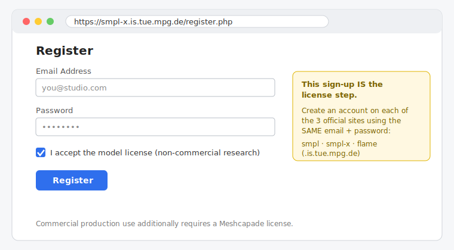
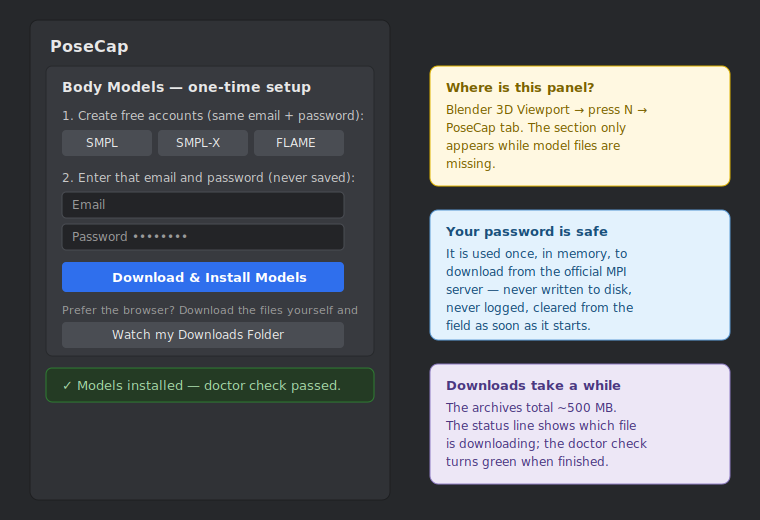
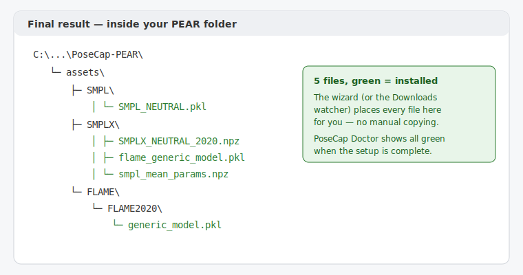

# Setting up the SMPL-X body models

PoseCap drives a research body model (SMPL-X) that is **licensed by the
Max Planck Institute and cannot ship inside PoseCap**. You download it
once with your own free account; PoseCap automates everything else.
Total time: about 5 minutes plus a ~500 MB download.

> Commercial production use of the body models requires a separate
> [Meshcapade license](https://meshcapade.com/) — the free accounts below
> cover non-commercial research use.

## Step 1 — Create your free accounts (the license step)

Create an account on each of the three official sites, using the **same
email and password** on all three (that keeps step 2 to a single login):

| Site | Link |
|---|---|
| SMPL | <https://smpl.is.tue.mpg.de/register.php> |
| SMPL-X | <https://smpl-x.is.tue.mpg.de/register.php> |
| FLAME | <https://flame.is.tue.mpg.de/register.php> |

Signing up (and ticking the license checkboxes) **is** the license
acceptance — there is nothing else to sign.

Check your inbox: each site sends a verification email you must confirm
before downloads work.

## Step 2 — Let PoseCap download and install everything

In Blender, open the **PoseCap panel** (3D Viewport → press `N` →
PoseCap tab). While model files are missing, the panel shows a
**Body Models — one-time setup** section:

1. Enter the email and password from step 1.
2. Click **Download & Install Models**.
3. Wait for the green **Models installed — doctor check passed** status.

Your password is used once, in memory, to download from the official MPI
server — it is never saved, never logged, and the field clears itself
the moment the download starts. A wrong password shows a friendly
message; just re-type and click again.

### Prefer not to type your password into Blender?

Click **Watch my Downloads Folder** instead, then download these files
from the official sites with your browser (log in first):

| Download this file | From |
|---|---|
| `SMPL_python_v.1.1.0.zip` | [SMPL downloads](https://smpl.is.tue.mpg.de/download.php) |
| `SMPLX_NEUTRAL_2020.npz` | [SMPL-X downloads](https://smpl-x.is.tue.mpg.de/download.php) |
| `FLAME2020.zip` | [FLAME downloads](https://flame.is.tue.mpg.de/download.php) |

PoseCap detects each file as it lands in your Downloads folder,
validates it, extracts what it needs, and installs it — no unzipping, no
file moving.

## What you end up with

Run **PoseCap Doctor** (Start Menu shortcut) any time — every check must
be green before the first live capture.

## Troubleshooting

| Message | Meaning | Fix |
|---|---|---|
| "…returned a web page instead of the file" | Wrong email/password for that site | Re-check the account on the site named in the message; re-enter and retry |
| "…is incomplete" | The download was interrupted | Click Download & Install again — finished files are kept, only missing ones are fetched |
| "…archive is corrupted" | A manual download was cut short | Delete the file from Downloads and download it again |
| Doctor still red on `pear_assets` | A file is missing or in the wrong place | Re-open the panel; the Body Models section lists what is still missing |
