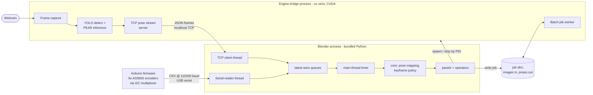
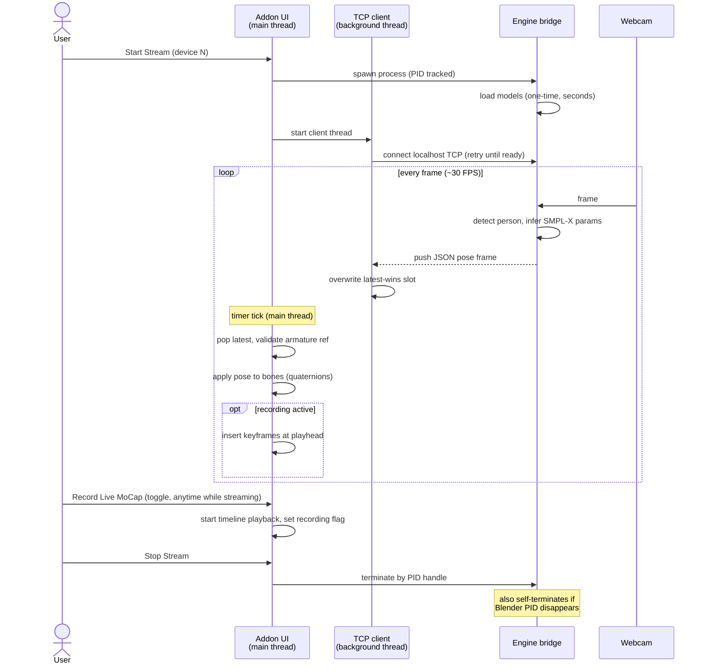
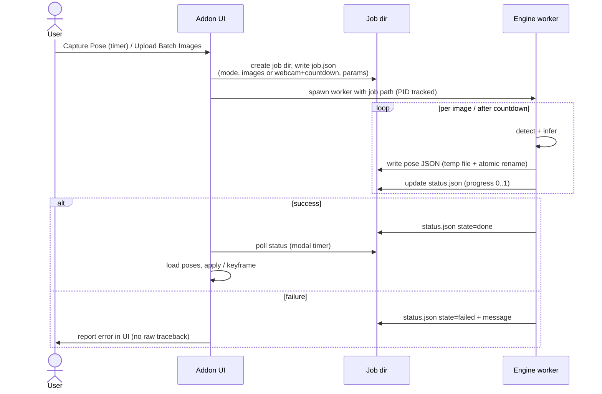
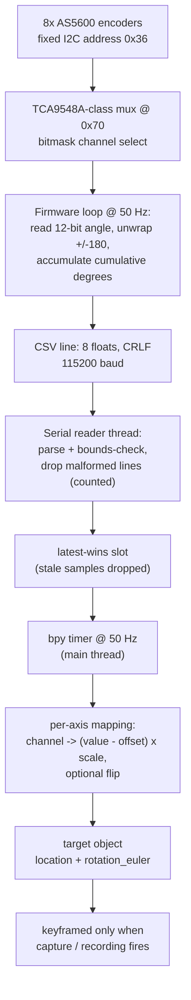
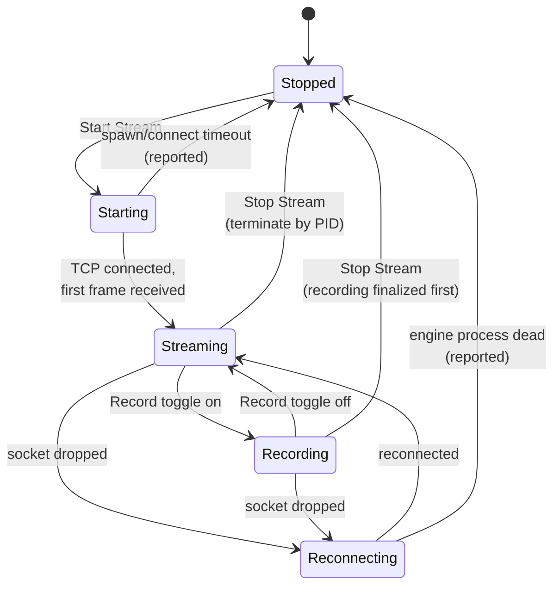
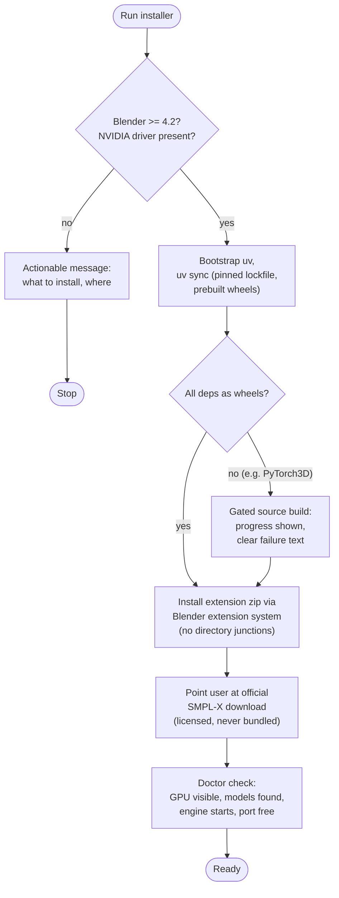

# Workflows

Functional flows of the system, diagrammed. This is the "how it works, step by step" companion to [ARCHITECTURE.md](../ARCHITECTURE.md) (which locks the patterns) and the [PRD](product/PRD.md) (which locks the scope). Each section: context first, then the diagram.

All flows describe the target design. Where the POC did something different that we deliberately replaced, a note says so — the evidence behind those calls is in [doc/reference/poc-verification.md](reference/poc-verification.md).

## System context

Three executables, joined by explicit contracts. Blender never imports torch; the engine never imports bpy; the firmware speaks plain CSV. The addon and engine exchange data over two channels only: a localhost TCP stream for live poses, and job files on disk for batch work.

## Live webcam streaming and Record Live MoCap

The flagship flow — verified working in the POC (20,329 successful pose loads in the last clean session). Differences from the POC: poses are pushed over TCP instead of polled from a pickle file's mtime; recording is independent of preview (POC trap: recording silently no-oped with preview off); the armature reference is validated every frame (POC's top live failure: 6,670 errors after the armature was deleted mid-stream).

## Image-to-pose jobs: single capture and batch

File-based by design — the artifacts on disk are the point (poses you can re-import later). Single capture and batch share one job pipeline; the POC proved both (capture pair + two batch runs on June 8). Progress/failure sidecar text files from the POC are replaced by one status JSON per job.

## Hardware rig input

The physical encoder rig drives the world transform of a target object; body pose always comes from the engine. Code-complete in the POC, never hardware-proven — first validation happens during the rewrite. The wire format is the POC's proven-simple contract: 8 comma-separated floats per line, no framing.

Known firmware limits (accepted, documented): unwrap assumes <180 degrees between consecutive reads — very fast spins alias; an unplugged encoder silently repeats its last value. "Reset to Origin" snapshots current channel values as offsets.

## Stream lifecycle

State machine the addon UI reflects. Failure paths are first-class: spawn timeout, socket drop, and engine crash all land back in Stopped with a reported reason — never a stuck UI (POC stopped processes by window title and had no failure states).

## Installation

The project tradeoff statement applies here hardest: a working install on the first try beats everything. The POC's documented install path was never actually proven (Dean ran a conda env); this flow ships tested on a clean machine. No source compiles unless no wheel exists — and then gated with explicit progress and actionable failure messages.

## Reading guide

| Question | Document |
|---|---|
| What is this product, who is it for | [README](../README.md), [PRD](product/PRD.md) |
| How does feature X flow, step by step | this file |
| What patterns bind the code | [ARCHITECTURE.md](../ARCHITECTURE.md) |
| What are the engineering rules | [GUIDELINES.md](../GUIDELINES.md) |
| What did the POC actually prove | [poc-verification.md](reference/poc-verification.md) |
| Why was decision X made | [doc/adr/](adr/) |
